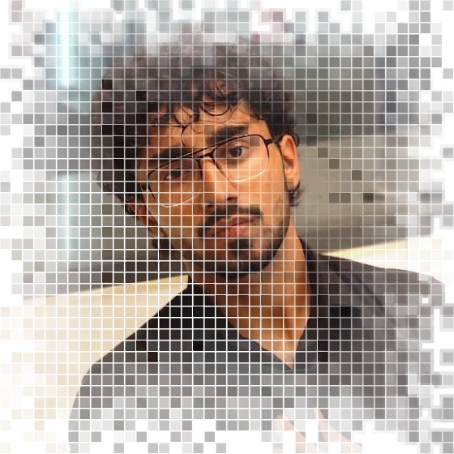
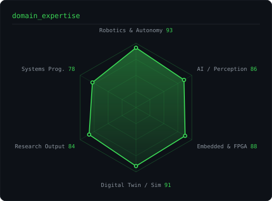
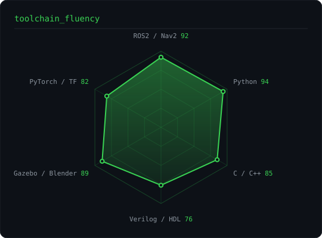
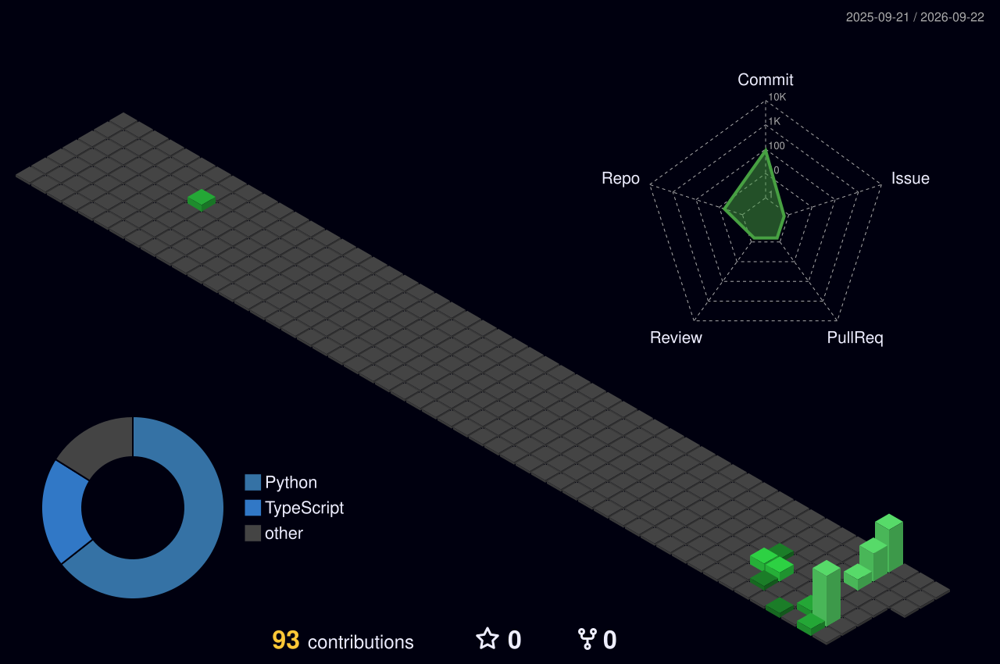

<div align="center">



<h1>Ayaan Aatif</h1>

<a href="https://github.com/drhafiz-ayaan">
  
</a>

<br/>

<a href="https://www.linkedin.com/in/ayaan-aatif-867a3128b"></a>
<a href="https://scholar.google.com/citations?user=ABC3PioAAAAJ&hl=en"></a>
<a href="mailto:drhafiz.ayaan@gmail.com"></a>


</div>

---

## `❯ whoami`

```console
$ cat /etc/ayaan/identity
```

Electrical Engineering undergraduate at **NUST**, building machines that perceive, decide and move on their own.

I work where **robotics, embedded hardware and machine learning collapse into one stack** — autonomous navigation on FPGA, real-time digital twins that stay synchronised with the physical world, and perception models small enough to run at the edge.

- 🔬 **Research Assistant** at Pakistan's **National Center of Artificial Intelligence (NCAI)** — neural rendering and Gaussian splatting in the AI & Computer Vision group, plus digital-twin systems for autonomous platforms.
- 📡 **Research Collaborator** at an **RF Antenna & EMC Testing Laboratory** — integrating antenna subsystems into robotic platforms.
- 🚀 **Founder & Technical Lead @ AyroX Labs** — intelligent drones, digital twins and AI-enabled inspection systems.
- 🧾 **Founder @ FormatIQ** — a research-automation platform for academic formatting (reports, theses, CVs, IEEE papers).
- 📄 **6 papers** published or accepted across swarm robotics, FPGA navigation, edge computer vision and IoT security.
- 🏆 **Regional Winner**, Alibaba Cloud AI Hackathon — *TwinVerse Inspect AI*.
- 🎯 Currently seeking **research and engineering internships** in autonomous systems and applied ML.

---

## `❯ research --list`

```console
$ ls ~/publications | wc -l
6
```

**`01`** &nbsp; &nbsp;`IEEE ACDSA 2025 · Antalya, Türkiye`
> ### Fault-Tolerant Adaptive Routing in NoCs: Machine Learning Approaches for Resilient On-Chip Networks
> M. Adnan, M. A. Chaudary, M. M. Ali, **H. A. Aatif**, M. I. Raza, H. A. Ramzan · pp. 1–7 · [`doi:10.1109/ACDSA65407.2025.11165816`](https://doi.org/10.1109/ACDSA65407.2025.11165816)

**`02`** &nbsp; &nbsp;`IEEE Conference`
> ### A Hardware-in-the-Loop Multi-Sensor Fusion Framework for Low-Latency Autonomous Navigation on FPGA-Based Mobile Robots
> Sensor fusion on reconfigurable hardware — closing the loop between perception and motion inside the FPGA fabric.

**`03`** &nbsp;
> ### Decentralized Formation Control of Miniature Robots using the SCOPE Strategy
> Swarm formation control with no central coordinator.

**`04`** &nbsp;
> ### Robust Zero-Day Intrusion Prevention in IoT Networks Using Hybrid Machine Learning
> Detecting attacks that have no signature yet, on constrained IoT hardware.

**`05`** &nbsp;
> ### LARD: Lightweight Attention-Augmented Real-Time Detection for Occlusion-Robust Pedestrian Recognition on Edge Hardware
> Attention where it pays for itself — pedestrians stay detected through occlusion, at edge latency.

**`06`** &nbsp; &nbsp;`GIKI International Conference 2026`
> ### Machine Learning Approaches for Network Intrusion Detection in IoT Environments
> Accepted; presentation scheduled November 2026.

<sub>Full record on <a href="https://scholar.google.com/citations?user=ABC3PioAAAAJ&hl=en">Google Scholar →</a></sub>

---

## `❯ toolbox`

<div align="center">


<br/><br/>


</div>

---

## `❯ skill-radar`

<div align="center">
  
  &nbsp;&nbsp;
  
</div>

---

## `❯ selected-work`

<table>
<tr>
<td width="50%" valign="top">

### 🛰️ TwinVerse Inspect AI
**Regional Winner — Alibaba Cloud AI Hackathon**

AI infrastructure-inspection platform that fuses **drone, CCTV, robotic and smartphone** feeds into one pipeline: defect detection, severity scoring, predictive-maintenance analytics and live digital-twin visualisation.

`Python` `Computer Vision` `Digital Twin` `Cloud`

[**→ repository**](https://github.com/drhafiz-ayaan/twinverse-inspect-ai)

</td>
<td width="50%" valign="top">

### 🌊 Underwater Robotic Arm
Manipulator integration and autonomous control work from the **Aerial Robotics Laboratory** — kinematics, actuation and perception for submerged operation.

`Python` `ROS2` `Control`

[**→ repository**](https://github.com/drhafiz-ayaan/underwater-robotic-arm)

</td>
</tr>
<tr>
<td width="50%" valign="top">

### ⛏️ Minecraft RL Navigation
Reinforcement-learning agent that learns to navigate Minecraft worlds — a sandbox for reward shaping, exploration strategy and policy transfer.

`RL` `Python` `Gym`

[**→ repository**](https://github.com/drhafiz-ayaan/minecraft_rl_project)

</td>
<td width="50%" valign="top">

### ☕ Café Service RL
Reinforcement-learning agent for a service-robot task: multi-goal navigation, task sequencing and reward design in a simulated café.

`RL` `Python` `Simulation`

[**→ repository**](https://github.com/drhafiz-ayaan/Cafe-Rl-Project)

</td>
</tr>
<tr>
<td width="50%" valign="top">

### 🤖 Gazebo Robot Car
Ground-up Gazebo world and differential-drive vehicle — the reference setup for bootstrapping new simulation stacks.

`CMake` `Gazebo` `ROS2`

[**→ repository**](https://github.com/drhafiz-ayaan/Robot_car_draw_square)

</td>
<td width="50%" valign="top">

### 🧬 TwinVerse Digital Twin &amp; Sim2Real
Real-time synchronised digital-twin environment with semantic scene understanding, plus a **ROS2 pipeline that deploys learned policies from simulation onto real hardware**.

`ROS2` `Sim2Real` `Semantic Mapping`

<sub>🔒 Private — research in progress</sub>

</td>
</tr>
</table>

---

## `❯ the-numbers`

<div align="center">


<br/>


<br/><br/>


</div>

---

## `❯ contribution-calendar`

<div align="center">



<br/>

<picture>
  <source media="(prefers-color-scheme: dark)" srcset="https://raw.githubusercontent.com/drhafiz-ayaan/drhafiz-ayaan/output/snake-dark.svg" />
  <source media="(prefers-color-scheme: light)" srcset="https://raw.githubusercontent.com/drhafiz-ayaan/drhafiz-ayaan/output/snake.svg" />
  
</picture>

</div>

<!--
  Optional: the classic github-readme-stats cards.
  The public instance (github-readme-stats.vercel.app) was returning 503 when this
  README was written, so they are parked here. Deploy your own fork to Vercel and
  swap in your instance URL, then uncomment.

  /api?username=drhafiz-ayaan&show_icons=true&include_all_commits=true&count_private=true&hide_border=true&bg_color=0D1117&title_color=39D353&icon_color=39D353&text_color=8B949E&ring_color=39D353" />
  /api/top-langs/?username=drhafiz-ayaan&layout=compact&langs_count=8&hide_border=true&bg_color=0D1117&title_color=39D353&text_color=8B949E" />
-->

---

## `❯ credentials`

| | |
|:--|:--|
| 🎓 **BE Electrical Engineering** | NUST, Pakistan · 2024 – 2028 (expected) · robotics, embedded systems, AI |
| 📜 **ROS2 Professional Training** | Professional certification |
| 🏅 **Regional Winner** | Alibaba Cloud AI Hackathon — TwinVerse Inspect AI |
| 🎤 **Presenter** | GIKI International Conference 2026 |
| 🛠️ **Participant** | Indus Ras Expo Engineering Competition |
| 💼 **Fiverr Level 2 Seller** | Robotics, AI and embedded projects for international clients · 5★ |
| 🌍 **Languages** | Urdu (native) · English (C1) |

---

<div align="center">

```console
$ echo "01110100 01101000 01100001 01101110 01101011 01110011" | perl -lape '$_=pack "B*", join "", split " "'
thanks
```

**Open to research collaborations, internships and hard robotics problems.**

<a href="mailto:drhafiz.ayaan@gmail.com"></a>

<sub><code>❯ exit 0</code></sub>

</div>
